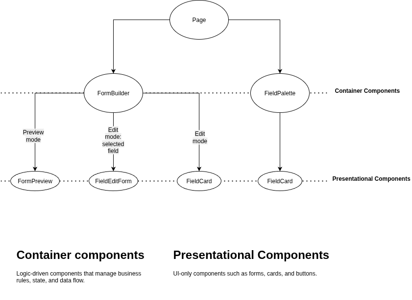

# Nuxt Minimal Starter

Look at the [Nuxt documentation](https://nuxt.com/docs/getting-started/introduction) to learn more.

## Setup

Make sure to install dependencies:

```bash
npm install
```

## Development Server

Start the development server on `http://localhost:3000`:

```bash
npm run dev
```

## Production

Build the application for production:

```bash
npm run build
```

Locally preview production build:

```bash
npm run preview
```

## App's architecture



This pattern differentiates between container components and presentational components, with each serving a focused purpose.

### Advantages

- **Centralized business logic** – rules and processes are managed in container components, reducing duplication.  
- **Separation of concerns** – business logic and state management are isolated from UI rendering.  
- **Maintainability** – fixes, updates, and enhancements can be made with minimal impact on unrelated parts of the codebase.  
- **Reusability** – presentational components can be reused across multiple containers and features.
- **Testability** – logic and presentation can be tested independently for greater reliability.  
